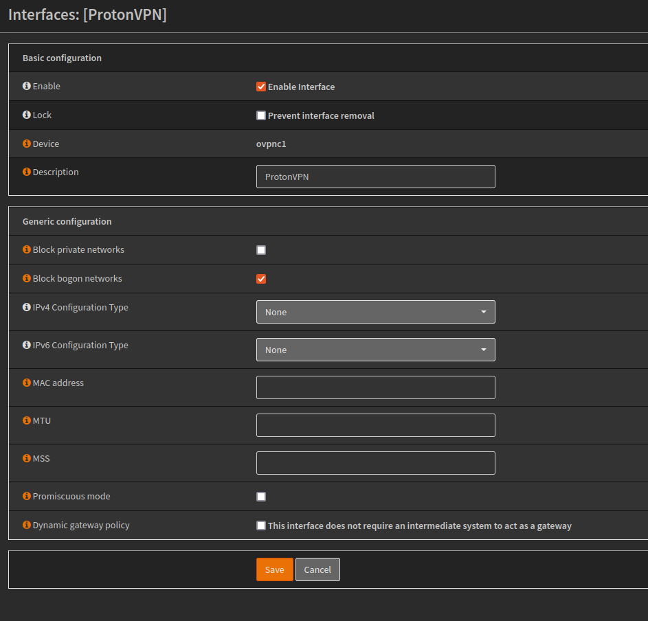

Setting up a VPN Gateway in OPNsense with ProtonVPN

Go to ProtonVPN, sign in with your credentials.
From the left navigation pane, select OpenVPN/IKEv2

 

Under OpenVPN configuration files, select the router radio button, select the UDP radio button, then scroll down and select a mirror of your choice. Download the .ovpn file.

 

Open the .ovpn file with a text editor, and set to the side.

 

Log into OPNsense. From the left navigation pane, select System > Trust > Authorities.

 

Press the + button to add a new certificate authority. Enter in a description. Copy the certificate portion from the opened .ovpn text file and paste it into certificate data. Then press save.

 

Go to VPN > OpenVPN > Clients. 

 

Press the + button to create a new OpenVPN client. Provide a name. Set protocol to UDP4 or TCP4 depending on certificate. Set interface to WAN. Enter the server information from the .ovpn file. Check the select remote server at random box (if more than one server/port combination was entered). Check the Infinitely resolve remote server box.

 

Under User Authentication Settings, enter the username and password shown to you on ProtonVPN’s website.

 

Uncheck the automatic TLS key box, and copy and paste the TLS certificate information into the TLS Shared Key Box. Set Certificate Authority as ProtonVPN. Set Encryption Algorith to AES-256-GCM. Set Auth Digest Algorithm as SHA512.

 

<<<<<<< HEAD
Under advanced configuration add [tun-mtu 1500; tun-mtu-extra 32; mssfix 1450; persist-key; persist-tun; reneg-sec 0; remote-cert-tls server; pull;] without brackets. Set Verbosity level to 3, and save.

 

Go To Interfaces > Assignments. There should be a new interface listed with an orange + symbol next to it. Click the +. The click on the hyperlink of that new interface and edit. Create a description. Check the block bogon networks box. Check the Dynamic gateway policy box. Click save and apply changes.
=======
Go To Interfaces > Assignments. There should be a new interface listed with an orange + symbol next to it. Click the +. The click on the hyperlink of that new interface and edit. Create a description. Check the block bogon networks box. Click save and apply changes.
>>>>>>> b2869aeaa891bf9178a5dc7571bc972ec9fc2db9

 

Go to Firewall > NAT > Outbound. Select the Hybrid outbound NAT rule generation radio button and press save. Create a new manual rule with the + button.

 

Select the ProtonVPN interface. Leave everything as default and save, then select apply changes.

<<<<<<< HEAD

Complete. All your outbound traffic will now travel through the VPN.
=======
>>>>>>> b2869aeaa891bf9178a5dc7571bc972ec9fc2db9
